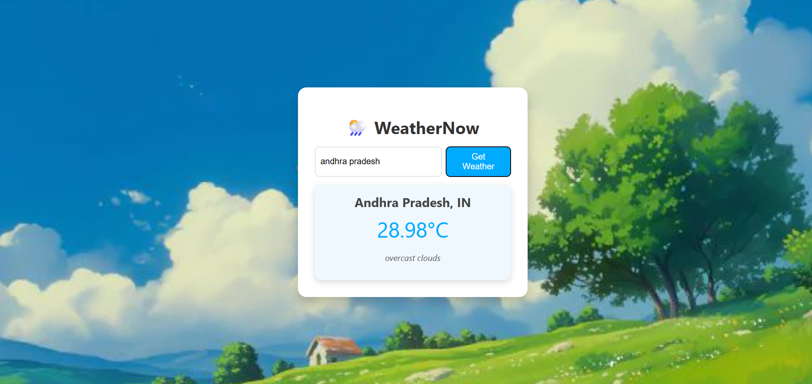

# 🌤️ WeatherNow

**WeatherNow** is a full-stack weather web application built with **Spring Boot** and **React**, integrating the **OpenWeather API** to fetch and display real-time weather data based on user input. It features a clean and responsive UI with background visuals for an enhanced user experience.

## 📸 Demo

## 🛠️ Tech Stack

### Backend:
- Java 17
- Spring Boot
- RestTemplate
- OpenWeatherMap API

### Frontend:
- React
- Axios
- CSS (with background image styling)

## 📦 Features

- 🔍 Search weather by city name
- 🌡️ Real-time temperature, humidity, weather condition
- 🌐 RESTful API architecture
- 🎨 Responsive and attractive UI with background image
- 🔁 Handles loading, error states, and unknown cities gracefully

## Acknowledgments

- [OpenWeatherMap API](https://openweathermap.org/api)
- Spring Boot & React Communities